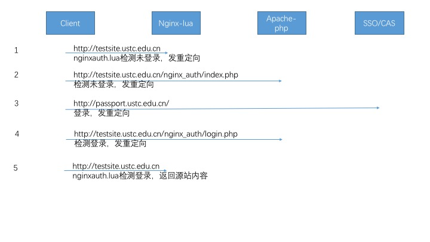

### 使用lua对反向代理做权限控制

为了安全考虑，部分网站在校内可以直接访问，校外访问时需先经过一次用户认证，从而避免把网站直接暴露到校外，减少一些非针对性的安全威胁。

使用nginx lua中的access_by_lua功能，在每次访问时，通过lua程序判断是否允许访问。

首先根据IP地址判断，如果在白名单内，直接返回源站内容。

否则进行用户认证。认证后，将 nginx_auth_uid，nginx_auth_expire, nginx_auth_hash 写入cookie。

认证后，根据以上三个cookie信息，在一定时间内，返回源站内容。

致谢：代码参考了 https://github.com/StephenPCG/nginx-lua-simpleauth-module

